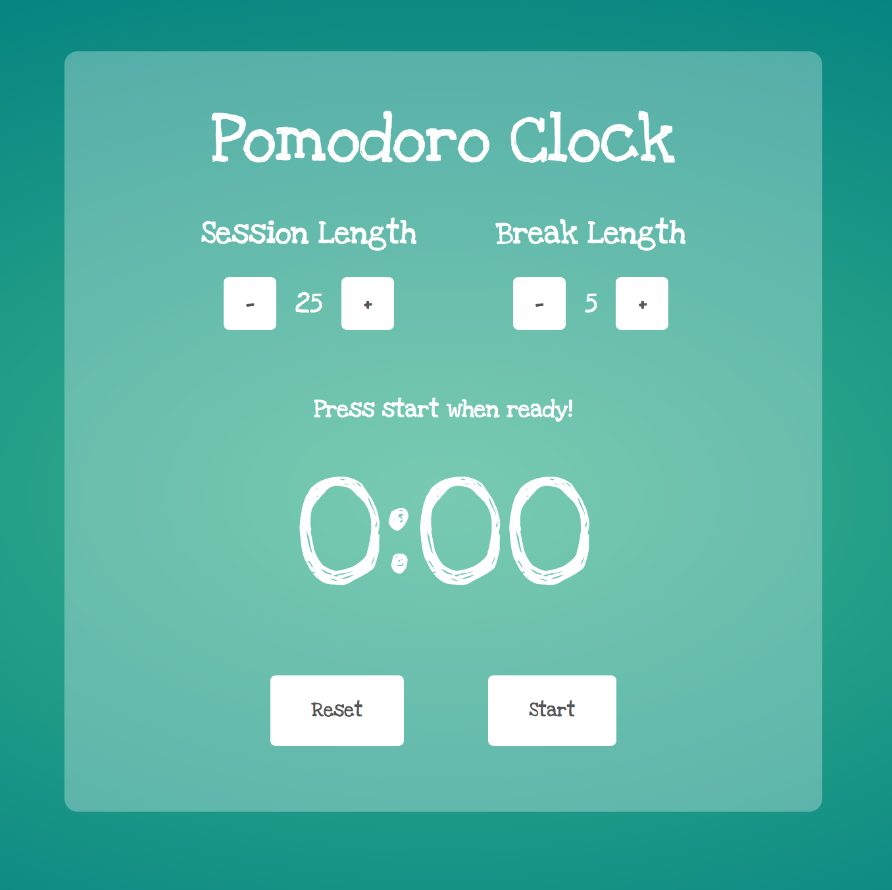

# FreeCodeCamp Pomodoro Clock

This project showcases a modern looking pomodoro clock.

The pomodoro clock is preset with 25 minutes session time and 5 minutes break time. Both session time and break time can be custom set.

When you click start button to trigger pomodoro clock, it will elapse until finish countdown with notification sound alert. Right after that break time will start off to count down. Similarly, once break time has finished countdown, notification sound will kick in to alert.

A reset button is there for restart pomodoro clock. It can also be used when the pomodoro clock is running to restart to its initial state.

[View demo site here to give a try.](http://edwinchen.co/fcc_pomodoro_clock/)

